# 🚀 Veritas — See Beyond the Deck, Invest with Confidence

> **Advanced 17-Agent AI Investment Analysis Platform** - Complete startup evaluation system with event-driven orchestration, human-in-the-loop capabilities, and real-time monitoring.

## 

[](https://cloud.google.com/)
[](https://cloud.google.com/vertex-ai)
[](https://developers.google.com/)
[](https://python.org/)
[](https://ai.google/)
[](https://cloud.google.com/run)
[](https://fastapi.tiangolo.com/)

## 📋 Table of Contents

- [🎯 Overview](#-overview)
- [✨ Features](#-features)
- [🏗️ Architecture](#️-architecture)
- [🤖 AI Agents](#-ai-agents)
- [📊 Workflow](#-workflow)
- [🚀 Quick Start](#-quick-start)
- [☁️ Cloud Deployment](#️-cloud-deployment)
- [📚 API Documentation](#-api-documentation)
- [🔧 Configuration](#-configuration)
- [📁 Project Structure](#-project-structure)
- [🧪 Testing](#-testing)
- [🔒 Security](#-security)
- [📈 Performance](#-performance)
- [🤝 Contributing](#-contributing)
- [📄 License](#-license)

## 🎯 Overview

**Veritas** is a comprehensive 17-agent AI investment analysis platform that leverages advanced AI agents to process startup pitch decks, conduct automated meetings, perform deep diligence, and generate professional investment recommendations. Built with Google Cloud services (Vertex AI, Gemini), Perplexity AI for real-time data enrichment, and deployed on Firebase Functions with event-driven orchestration.

### 🎪 What It Does

1. **📄 Ingests** pitch decks, founder videos, and LinkedIn profiles
2. **🔍 Validates** financial claims, market data, and founder backgrounds
3. **🤖 Conducts** AI-powered investor meetings with automated Q&A
4. **📊 Performs** deep diligence with competitor benchmarking and risk scoring
5. **📝 Generates** professional investment memos (Memo 1, 2, 3)
6. **🎯 Provides** actionable investment recommendations with deal structuring
7. **👥 Matches** startups with appropriate VCs and investors
8. **📊 Tracks** the entire evaluation pipeline with real-time monitoring

### 🎯 Target Users

- **💼 VCs & Investors**: Streamline deal flow and due diligence with professional investor rooms
- **🚀 Startup Founders**: Get AI-powered feedback on pitch materials and connect with investors
- **🏢 Investment Firms**: Standardize evaluation processes with automated workflows
- **📈 Accelerators**: Screen and evaluate startup applications efficiently
- **📱 Mobile Users**: Access all platform features on-the-go with native mobile app

## ✨ Features

### 🧠 Advanced 17-Agent Architecture
- **Multi-Layer Pipeline**: 5 layers of specialized AI agents
- **Event-Driven Orchestration**: Google Pub/Sub event bus for real-time coordination
- **Human-in-the-Loop**: Investor review and override capabilities
- **Vertex AI Integration**: Leverages Google Gemini models for structured data extraction
- **Perplexity AI Enrichment**: Real-time web search and data validation
- **Real-time Processing**: Instant analysis and memo generation
- **Context-Aware Analysis**: Understands startup ecosystem nuances
- **Vector Search**: RAG-based diligence analysis with embeddings

### 📊 Comprehensive Analysis
- **Financial Validation**: Verifies revenue, growth, and funding claims using Perplexity AI and public sources
- **Market Analysis**: TAM/SAM/SOM validation with industry benchmarks from real-time data
- **Competitive Intelligence**: Identifies and analyzes competitors via Crunchbase, Tracxn, and web sources
- **Founder Assessment**: Evaluates team experience and market fit with LinkedIn and background checks
- **Memo Enrichment**: Automatically fills missing fields using Perplexity API and Vertex AI
- **Validation Framework**: 10-category validation system with confidence scoring
- **AI Meeting Bot**: Automated investor-founder meetings with Q&A
- **Risk Scoring**: Advanced risk assessment with multiple factors
- **Deal Structuring**: Automated term sheet generation

### 🎨 Professional Output
- **Investment Memos**: Three versions (Memo 1, 2, 3) with increasing detail
- **Risk Assessment**: Identifies and categorizes investment risks
- **Scoring System**: Weighted scoring across multiple dimensions
- **Recommendations**: Clear invest/watchlist/pass recommendations
- **VC Matchmaking**: Matches startups with appropriate investors (frontend-based matching with Firestore integration)
- **Engagement Automation**: Automated follow-up communications
- **Investor Rooms**: Secure data rooms with professional purple-themed UI for investor-founder collaboration
- **Mobile App**: Native mobile application for iOS and Android (Firebase App Distribution)

### ☁️ Cloud-Native & Scalable
- **Firebase Functions**: Serverless, auto-scaling backend deployment (asia-south1 region)
- **Next.js Frontend**: Modern React-based web application with TypeScript and professional UI design
- **Firestore**: Real-time database for state management and document storage
- **BigQuery**: Analytics and reporting for investment data
- **Vector Search**: Embeddings storage for RAG-based diligence queries
- **Event-Driven Architecture**: Pub/Sub for reliable event handling
- **Auto-scaling**: Handles varying workloads automatically
- **Cost-effective**: Pay only for actual usage
- **Global Availability**: Deploy anywhere in Google Cloud regions
- **Mobile Application**: Native mobile app available via Firebase App Distribution

### 📱 Mobile Application
- **Native Mobile App**: Access Veritas services on iOS and Android devices
- **Firebase App Distribution**: Easy distribution for beta testing and internal use
- **Download Link**: Available on the landing page for quick access
- **Full Feature Access**: Complete platform functionality on mobile devices

## 🏗️ Platform Architecture

### 🎯 System Overview

Veritas is built on a **serverless, event-driven architecture** using Firebase Functions for backend processing and Next.js for the frontend interface. The platform processes startup pitch decks through a multi-stage pipeline of specialized AI agents, each responsible for specific analysis tasks.

### 📐 Core Components

1. **Frontend (Next.js)**: React-based user interface for founders and investors
2. **Backend (Firebase Functions)**: Serverless functions handling agent orchestration
3. **AI Services**: Perplexity API for real-time data enrichment, Vertex AI (Gemini) for structured analysis
4. **Data Layer**: Firestore for real-time state, BigQuery for analytics, Vector Search for RAG queries
5. **Event System**: Google Pub/Sub for asynchronous agent coordination

### 🔄 Complete Platform Flow

```mermaid
sequenceDiagram
    participant User as 👤 User (Founder/Investor)
    participant FE as 🎨 Next.js Frontend
    participant CF as ⚡ Cloud Function
    participant FS as 🔥 Firestore
    participant IA as 🤖 Intake Agent
    participant MA as 🤖 Memo Enrichment Agent
    participant VA as 🤖 Validation Agent
    participant PP as 🔍 Perplexity API
    participant GA as 🧠 Vertex AI (Gemini)

    User->>FE: Upload Pitch Deck PDF
    FE->>CF: HTTP POST /on_file_upload
    CF->>FS: Create upload record
    CF->>FS: Publish Pub/Sub event
    CF-->>FE: Return processing status
    
    Note over CF,FS: Asynchronous Processing Begins
    
    CF->>IA: Trigger Intake Agent
    IA->>GA: Extract structured data from PDF
    GA-->>IA: Return memo_1 JSON
    IA->>FS: Save to ingestionResults collection
    FS->>FE: Real-time update (WebSocket/Firestore listener)
    
    User->>FE: Request Validation/Enrichment
    FE->>CF: HTTP POST /validate_memo_data
    CF->>FS: Fetch memo_1 from ingestionResults
    CF->>MA: Trigger Memo Enrichment Agent
    
    MA->>MA: Identify missing fields
    loop For each missing field
        MA->>PP: Query Perplexity API
        PP-->>MA: Return enriched data + sources
    end
    
    MA->>GA: Structure enriched data (Vertex AI)
    GA-->>MA: Return structured JSON
    MA->>VA: Trigger Validation Agent
    
    VA->>PP: Validate 10 categories (Company, Founder, Market, etc.)
    PP-->>VA: Return validation results + confidence scores
    
    VA->>FS: Save enriched data to memo1_validated
    VA->>FS: Save validation results
    FS->>FE: Real-time update
    
    FE->>User: Display enriched memo + validation report
```



### 🏗️ Architecture Diagram


### 🏛️ System Components

#### **MCP Server (Agent Control Plane)**
- **FastAPI Application**: REST API with WebSocket support
- **Event Bus**: Google Pub/Sub for reliable event handling
- **Workflow Engine**: Temporal.io-style orchestration
- **Context Store**: Firestore for real-time state, BigQuery for analytics
- **Human-in-the-Loop**: Review and override capabilities

#### **17-Agent Pipeline**
- **Layer 1 - Ingestion & Capture**: Intake Curation, Compliance
- **Layer 2 - Engagement & Interaction**: AI Meeting, Sentiment, Synthesis
- **Layer 3 - Deep Diligence & Analysis**: Benchmarking, Financial, Risk, Final Diligence
- **Layer 5 - Investor Outcome**: Deal Structuring, Matchmaking, Engagement

#### **Data Layer**
- **Claims Schema**: Structured claim representation
- **Memo Schema**: Investment memo data models (Memo 1, 2, 3)
- **Google Services**: Cloud storage, AI, and analytics

#### **Infrastructure Layer**
- **Google Cloud Run**: Containerized, auto-scaling deployment
- **Google ADK**: AI agent framework
- **Event-Driven Architecture**: Pub/Sub event bus
- **Real-time Monitoring**: WebSocket and dashboard integration

## 🤖 How Agents Work - Deep Dive

### 🧠 Agent Architecture Pattern

Each agent in Veritas follows a **standardized architecture pattern** that enables modular, scalable, and testable components:

```
┌─────────────────────────────────────────┐
│         Agent Base Pattern              │
├─────────────────────────────────────────┤
│ 1. Initialization (set_up)             │
│    - Initialize Firestore client        │
│    - Initialize AI service clients       │
│    - Set logging configuration          │
├─────────────────────────────────────────┤
│ 2. Data Fetching                        │
│    - Fetch input data from Firestore    │
│    - Validate data completeness         │
│    - Handle missing data gracefully     │
├─────────────────────────────────────────┤
│ 3. Processing                           │
│    - Execute agent-specific logic       │
│    - Call external APIs (Perplexity, AI)│
│    - Transform and enrich data          │
├─────────────────────────────────────────┤
│ 4. Validation                           │
│    - Validate output quality            │
│    - Calculate confidence scores        │
│    - Check for errors                   │
├─────────────────────────────────────────┤
│ 5. Storage                               │
│    - Save results to Firestore          │
│    - Update status tracking             │
│    - Emit events for next agents        │
└─────────────────────────────────────────┘
```

### 🔄 Agent Communication Flow

Agents communicate through **Firestore collections** and **Pub/Sub events**:


### 📊 Agent Execution Lifecycle


## 🤖 AI Agents

### **Layer 1: Ingestion & Capture**

#### 1. 📝 Intake Curation Agent (`agents/intake_curation_agent.py`)
**Purpose**: Standardizes raw founder-submitted data into structured fields
**Capabilities**: PDF/PPTX processing, video analysis, LinkedIn profile extraction
**Input**: Pitch deck, founder video, LinkedIn URLs
**Output**: Structured JSON with founder, problem, solution, market, team data

#### 2. ✅ Compliance Agent (`agents/compliance_agent.py`)
**Purpose**: Early risk screening for regulatory and sanctions red flags
**Capabilities**: AML/KYC checks, jurisdiction-specific license validation, PEP screening
**Input**: Founder profile, company name, sector
**Output**: Compliance status and regulatory requirements

### **Layer 2: Engagement & Interaction**

#### 3. 🤖 AI Meeting Agent (`agents/ai_meeting_agent.py`)
**Purpose**: Automates investor-founder meetings with intelligent Q&A
**Capabilities**: Google Meet integration, live transcription, structured Q&A extraction
**Input**: Memo 1 data, investor preferences
**Output**: Meeting transcript with Q&A pairs and insights

#### 4. 💬 Sentiment Communication Agent (`agents/sentiment_communication_agent.py`)
**Purpose**: Analyzes founder confidence, transparency, and communication style
**Capabilities**: NLP sentiment analysis, confidence scoring, transparency assessment
**Input**: Meeting transcript
**Output**: Confidence scores and communication insights

#### 5. 📋 Synthesis Agent (`agents/synthesis_agent.py`)
**Purpose**: Creates Memo 2 by merging intake, validation, and meeting insights
**Capabilities**: Data synthesis, memo generation, insight integration
**Input**: Intake JSON, validation results, meeting Q&A
**Output**: Memo 2 with enhanced insights

### **Layer 3: Deep Diligence & Analysis**

#### 6. 🏆 Competitor Benchmarking Agent (`agents/competitor_benchmarking_agent.py`)
**Purpose**: Maps startup against competitors and market positioning
**Capabilities**: Crunchbase/Pitchbook analysis, competitive landscape mapping
**Input**: Startup vertical and sector
**Output**: Competitor analysis and positioning insights

#### 7. 💰 Financial Projection Agent (`agents/financial_projection_agent.py`)
**Purpose**: Sanity-checks founder financial projections against benchmarks
**Capabilities**: Financial model validation, sector benchmark comparison
**Input**: Financial model and projections
**Output**: Projection analysis and benchmark comparison

#### 8. ⚠️ Risk Scoring Agent (`agents/risk_scoring_agent.py`)
**Purpose**: Converts diligence into numeric risk assessment
**Capabilities**: Multi-factor risk analysis, weighted scoring, risk categorization
**Input**: Memo data and financial model
**Output**: Risk scores and assessment

#### 9. 📊 Final Diligence Agent (`agents/final_diligence_agent.py`)
**Purpose**: Produces the ultimate Memo 3 for investment decision
**Capabilities**: Comprehensive analysis, final recommendation, decision support
**Input**: Memo 2, extra diligence docs
**Output**: Memo 3 with final recommendation

### **Layer 5: Investor Outcome**

#### 10. 💼 Deal Structuring Agent (`agents/deal_structuring_agent.py`)
**Purpose**: Suggests initial term sheet and deal structure
**Capabilities**: Valuation analysis, equity calculation, term sheet generation
**Input**: Startup valuation, investor target, risk assessment
**Output**: Deal structure and term sheet suggestions

#### 11. 👥 Matchmaking Agent (`agents/matchmaking_agent.py`)
**Purpose**: Matches startups with appropriate VCs and investors
**Capabilities**: Investor preference matching, portfolio fit analysis
**Input**: Startup profile, risk assessment, deal suggestion
**Output**: VC recommendations and match scores

#### 12. 📧 Engagement Agent (`agents/engagement_agent.py`)
**Purpose**: Drafts follow-up communications and engagement materials
**Capabilities**: Professional communication generation, engagement automation
**Input**: Decision, startup profile, analysis results
**Output**: Engagement communications and follow-up materials

### **Legacy Agents (Still Supported)**

#### 13. 📄 Ingestion Agent (`agents/ingestion_agent.py`)
**Purpose**: Document processing and claim extraction
**Capabilities**: PDF/PPTX text extraction, image analysis, claim identification
**Input**: Raw document files
**Output**: Structured claims and company data

#### 14. 🔍 Validation Agent (`agents/validation_agent.py`)
**Purpose**: Claim verification against external data sources
**Capabilities**: Financial validation, market analysis, founder verification
**Input**: Extracted claims
**Output**: Validated claims with confidence scores

#### 15. 📝 Memo Agent (`agents/memo_agent.py`)
**Purpose**: Professional investment memo generation
**Capabilities**: Multi-version memos, risk assessment, scoring
**Input**: Validated claims and analysis
**Output**: Structured investment memos

### **Orchestration**

#### 16. 🎯 Orchestrator Agent (`agents/orchestrator_agent.py`)
**Purpose**: Coordinates the entire 17-agent pipeline
**Capabilities**: Workflow orchestration, agent coordination, error handling
**Input**: Document and analysis parameters
**Output**: Complete analysis pipeline results

## 📊 Workflow

### 🔄 17-Agent Analysis Pipeline


### 📈 Processing Stages

#### **Layer 1: Ingestion & Capture**
1. **📝 Intake Curation**
   - PDF/PPTX text extraction
   - Video analysis and transcription
   - LinkedIn profile processing
   - Structured data extraction

2. **✅ Compliance Check**
   - AML/KYC verification
   - Regulatory compliance screening
   - PEP (Politically Exposed Person) checks
   - Jurisdiction-specific requirements

#### **Layer 2: Engagement & Interaction**
3. **🤖 AI Meeting**
   - Automated investor-founder meeting
   - Google Meet integration
   - Live transcription and Q&A extraction
   - Meeting insights generation

4. **💬 Sentiment Analysis**
   - Founder confidence assessment
   - Communication style analysis
   - Transparency evaluation
   - Trust and credibility scoring

5. **📋 Synthesis (Memo 2)**
   - Integration of all Layer 1 & 2 data
   - Enhanced memo generation
   - Meeting insights incorporation
   - Risk factor identification

#### **Layer 3: Deep Diligence & Analysis**
6. **🏆 Competitor Benchmarking**
   - Market positioning analysis
   - Competitive landscape mapping
   - Industry benchmark comparison
   - Differentiation assessment

7. **💰 Financial Projection**
   - Financial model validation
   - Sector benchmark comparison
   - Growth projection analysis
   - Revenue model assessment

8. **⚠️ Risk Scoring**
   - Multi-factor risk analysis
   - Weighted risk scoring
   - Risk categorization
   - Mitigation strategy identification

9. **📊 Final Diligence (Memo 3)**
   - Comprehensive analysis synthesis
   - Final investment recommendation
   - Decision support documentation
   - Executive summary generation

#### **Layer 5: Investor Outcome**
10. **💼 Deal Structuring**
    - Term sheet generation
    - Valuation analysis
    - Equity calculation
    - Deal terms optimization

11. **👥 Matchmaking**
    - VC preference matching
    - Portfolio fit analysis
    - Investor recommendation
    - Introduction facilitation

12. **📧 Engagement**
    - Follow-up communication drafting
    - Engagement automation
    - Professional correspondence
    - Relationship management

## 🚀 Quick Start

### 📋 Prerequisites

- **Google Cloud Account** with billing enabled
- **Project ID**: `veritas-472301` (or your own GCP project)
- **Python 3.9+** installed locally
- **Node.js 20+** and npm 10+ for frontend development
- **Google Cloud SDK** (`gcloud`) installed
- **Firebase CLI** installed (`npm install -g firebase-tools`)
- **Perplexity API Key** (for data enrichment and validation)

### 📱 Mobile App Access

Download the Veritas mobile app for iOS and Android:
- **Download Link**: [Firebase App Distribution](https://appdistribution.firebase.dev/i/271a46c07956c054)
- Access available directly from the landing page
- Full platform functionality on mobile devices

### ⚡ Local Development

1. **Clone the repository**
```bash
git clone <repository-url>
cd VeritasAI
   ```

2. **Install backend dependencies**
   ```bash
cd functions
   pip install -r requirements.txt
   ```

3. **Install frontend dependencies**
```bash
cd ../frontend
npm install
```

4. **Set up environment variables**
```bash
# Backend - Create .env file in functions/
GOOGLE_CLOUD_PROJECT=veritas-472301
VERTEX_AI_LOCATION=asia-south1
PERPLEXITY_API_KEY=your_perplexity_api_key_here

# Frontend - Create .env.local in frontend/
NEXT_PUBLIC_FIREBASE_PROJECT_ID=veritas-472301
```

5. **Set up Google Cloud authentication**
```bash
   gcloud auth login
gcloud config set project veritas-472301
firebase login
   ```

6. **Run locally**
```bash
# Backend (Cloud Functions Emulator)
cd functions
python run_localhost.py

# Frontend (Next.js) - Using dev script
cd ..
chmod +x dev.sh
./dev.sh

# Or manually:
cd frontend
npm install
npm run dev
   ```

### 🧪 Test the Platform

```bash
# Test Perplexity API key
cd functions
python test_perplexity_key.sh
# or
bash verify-perplexity-secret.sh

# Test memo enrichment locally
python run_localhost.py

# Test validation framework
python test_validation_framework_local.py

# Frontend health check
curl -X GET http://localhost:3000

# Test evaluation endpoint (requires Firebase Functions emulator)
curl -X POST http://localhost:5001/veritas-472301/asia-south1/evaluate \
  -H "Content-Type: application/json" \
  -d '{
    "action": "evaluate",
    "file_data": "base64_encoded_pdf",
    "filename": "startup_pitch.pdf",
    "file_type": "pdf",
    "company_name": "My Startup"
  }'
```

## ☁️ Cloud Deployment

### 🚀 Deploy to Firebase Functions

1. **Set up Perplexity API key**
   ```bash
   # Store in Google Secret Manager
   bash setup-perplexity.sh
   # or
   bash verify-perplexity-secret.sh
   ```

2. **Enable required APIs**
   ```bash
   gcloud services enable \
     cloudfunctions.googleapis.com \
     aiplatform.googleapis.com \
     firestore.googleapis.com \
     pubsub.googleapis.com \
     cloudbuild.googleapis.com
   ```

3. **Deploy Cloud Functions**
   ```bash
   cd functions
   firebase deploy --only functions
   # or use deployment scripts
   bash ../deploy.sh
   ```

4. **Deploy Frontend**
   ```bash
   cd frontend
   npm run build:static
   firebase deploy --only hosting
   # or for App Hosting
   firebase deploy --only apphosting
   ```

5. **Verify deployment**
   ```bash
   # Check function deployment
   firebase functions:list
   
   # Test enrichment endpoint
   curl -X POST https://asia-south1-veritas-472301.cloudfunctions.net/enrich_memo \
     -H "Content-Type: application/json" \
     -d '{
       "memo_id": "your_memo_id",
       "company_name": "Test Company"
     }'
   ```

### 🔧 Deployment Configuration

**Cloud Functions (Backend)**:
- **Runtime**: Python 3.9
- **Memory**: 2GB (configurable up to 8GB)
- **Timeout**: 540 seconds (9 minutes)
- **Region**: asia-south1
- **Max Instances**: 100
- **Trigger**: HTTP
- **Authentication**: IAM-based or unauthenticated (configurable)

**Frontend (Next.js)**:
- **Framework**: Next.js 14+
- **Build**: Static export or App Hosting
- **Node Version**: 20+
- **Deployment**: Firebase Hosting or App Hosting

**Required APIs**:
- Firebase Functions API
- Vertex AI API (for Gemini models)
- Firestore API (database)
- Pub/Sub API (event handling)
- BigQuery API (analytics)
- Secret Manager API (for API keys)
- Cloud Build API (for deployments)

**Required Services**:
- **Perplexity API**: Real-time web search and validation
- **Vertex AI**: Gemini 2.5 Flash for structured extraction
- **Firestore**: Document storage and real-time state
- **BigQuery**: Analytics and reporting
- **Vector Search**: Embeddings storage (optional)

## 📚 API Documentation

### 🌐 MCP Server Endpoints

#### **Root Endpoint**
```http
GET /
```
**Response**: API information and available endpoints

#### **Start Workflow**
```http
POST /workflows
```

**Request Body**:
```json
{
  "name": "Startup Evaluation Pipeline",
  "steps": [
    {
      "step_id": "intake_curation",
      "agent_name": "intake_curation",
      "inputs": {
        "pitch_deck_data": "base64_data",
        "founder_video_data": "base64_data"
      }
    }
  ],
  "human_review_points": ["ai_meeting", "deal_structuring"],
  "context": {
    "pipeline_type": "startup_evaluation"
  }
}
```

#### **Get Workflow Status**
```http
GET /workflows/{workflow_id}
```

#### **Get Pending Reviews**
```http
GET /reviews
```

#### **Submit Review**
```http
POST /reviews/{review_id}
```

**Request Body**:
```json
{
  "review_id": "review_123",
  "decision": "approve",
  "comments": "Looks good to proceed",
  "overrides": {
    "risk_threshold": 0.3
  }
}
```

#### **WebSocket Real-time Updates**
```http
WS /ws
```

### 🌐 Main Application Endpoints

#### **Health Check**
```http
GET /health
```

#### **Full Pipeline Evaluation**
```http
POST /full_pipeline
```

**Request Body**:
```json
{
  "action": "full_pipeline",
  "pitch_deck_data": "base64_encoded_pitch_deck",
  "founder_video_data": "base64_encoded_video",
  "linkedin_urls": ["https://linkedin.com/in/founder1"],
  "meeting_transcript": "Meeting transcript text...",
  "startup_valuation": 30.0,
  "investor_target": 5.0,
  "company_name": "Startup Name",
  "sector": "fintech"
}
```

#### **AI Meeting Workflow**
```http
POST /ai_meeting
```

**Request Body**:
```json
{
  "action": "ai_meeting",
  "memo1_data": {
    "founder": "John Doe",
    "problem": "Market problem...",
    "solution": "AI solution..."
  },
  "investor_preferences": {
    "sector_focus": "fintech",
    "stage_preference": "Series A"
  },
  "meeting_type": "full_workflow"
}
```

### 📊 Response Schema

#### **Analysis Results**
```json
{
  "ingestion": {
    "company_name": "string",
    "sector": "string",
    "stage": "string",
    "claims": [
      {
        "type": "FINANCIAL|MARKET|TEAM|COMPETITION",
        "content": "string",
        "confidence": 0.0-1.0,
        "source": "string"
      }
    ]
  },
  "validation": {
    "validated_claims": [ /* validated claims */ ],
    "risk_flags": [ /* identified risks */ ],
    "confidence_scores": { /* validation scores */ }
  },
  "memo": {
    "executive_summary": "string",
    "investment_recommendation": "INVEST|WATCHLIST|PASS",
    "risk_assessment": "LOW|MEDIUM|HIGH",
    "scoring": {
      "founder_fit": 0.0-10.0,
      "market_opportunity": 0.0-10.0,
      "competitive_advantage": 0.0-10.0,
      "financial_metrics": 0.0-10.0,
      "overall_score": 0.0-10.0
    }
  }
}
```

## 🔧 Configuration

### 🌍 Environment Variables

**Backend (Firebase Functions)**:
```bash
# Google Cloud Configuration
GOOGLE_CLOUD_PROJECT=veritas-472301
VERTEX_AI_LOCATION=asia-south1

# AI Model Configuration
GEMINI_MODEL=gemini-2.5-flash
CONFIDENCE_THRESHOLD=0.7

# Perplexity API (Required for enrichment and validation)
PERPLEXITY_API_KEY=pplx-your-api-key-here

# Processing Configuration
MAX_FILE_SIZE_MB=50
SUPPORTED_FORMATS=pdf,pptx
PROCESSING_TIMEOUT=300
```

**Frontend (Next.js)**:
```bash
# Firebase Configuration
NEXT_PUBLIC_FIREBASE_PROJECT_ID=veritas-472301
NEXT_PUBLIC_FIREBASE_API_KEY=your-api-key
NEXT_PUBLIC_FIREBASE_AUTH_DOMAIN=veritas-472301.firebaseapp.com
```

### 🔑 Setting Up Perplexity API

The platform uses Perplexity AI for real-time data enrichment and validation. Follow these steps:

1. **Get Perplexity API Key**
   - Sign up at [Perplexity AI](https://www.perplexity.ai/)
   - Generate an API key from your account dashboard

2. **Store API Key Securely**
   ```bash
   # Using Google Secret Manager (Recommended)
   echo -n "pplx-your-api-key" | gcloud secrets create perplexity-api-key \
     --data-file=- \
     --project=veritas-472301
   
   # Or use the setup script
   bash setup-perplexity.sh
   ```

3. **Verify Setup**
   ```bash
   bash verify-perplexity-secret.sh
   ```

See [PERPLEXITY_VERTEX_AI_SETUP.md](PERPLEXITY_VERTEX_AI_SETUP.md) for detailed setup instructions.

### ⚙️ Agent Configuration

#### **Ingestion Agent**
```python
ingestion_agent = IngestionAgent(
    model="gemini-1.5-pro",
    project="your-project-id",
    location="us-central1",
    confidence_threshold=0.7,
    max_file_size_mb=50,
    supported_formats=["pdf", "pptx"]
)
```

#### **Validation Agent**
```python
validation_agent = ValidationAgent(
    model="gemini-1.5-pro",
    project="your-project-id",
    location="us-central1",
    confidence_threshold=0.8,
    validation_timeout=60
)
```

#### **Memo Agent**
```python
memo_agent = MemoAgent(
    model="gemini-1.5-pro",
    project="your-project-id",
    location="us-central1",
    memo_quality="professional",
    include_charts=True
)
```

## 📁 Project Structure

```
VeritasAI/
├── 📄 README.md                         # This file
├── 📋 package.json                      # Root package configuration
│
├── 🔥 functions/                        # Firebase Cloud Functions (Backend)
│   ├── 📄 main.py                       # Cloud Functions entry point
│   ├── 📋 requirements.txt              # Python dependencies
│   ├── 🚀 run_localhost.py              # Local testing script
│   │
│   ├── 🤖 agents/                       # AI Agent Pipeline
│   │   ├── orchestrator_agent.py       # Master orchestrator
│   │   ├── intake_curation_agent.py    # Document intake & curation
│   │   ├── memo_enrichment_agent.py    # Perplexity-based memo enrichment
│   │   ├── validation_agent.py          # Claim validation
│   │   ├── memo_agent.py               # Investment memo generation
│   │   └── [11 more agents...]         # Complete 17-agent system
│   │
│   ├── 🔧 services/                     # Service Layer
│   │   ├── perplexity_service.py        # Perplexity API integration
│   │   ├── google_validation_service.py # Vertex AI validation
│   │   └── [other services...]          # Additional service integrations
│   │
│   ├── 🧪 test_*.py                      # Test scripts
│   └── 📚 *.md                          # Documentation files
│
├── 🎨 frontend/                          # Next.js Frontend Application
│   ├── 📋 package.json                  # Frontend dependencies
│   ├── 🚀 dev.sh                        # Development server script
│   ├── 📁 src/                          # React/Next.js source code
│   │   ├── app/                         # Next.js app router
│   │   │   ├── page.tsx                 # Landing page with mobile app download
│   │   │   ├── founder/                 # Founder dashboard and features
│   │   │   │   ├── dashboard/
│   │   │   │   │   ├── investor-match/  # Investor matching (frontend-based)
│   │   │   │   │   └── datarooms/       # Investor Rooms (purple-themed UI)
│   │   │   └── dashboard/               # Investor dashboard
│   │   │       ├── diligence/           # Diligence Hub
│   │   │       └── memo/                # Deal Memo viewer
│   │   ├── components/                  # React components
│   │   │   ├── memo/                    # Memo-related components
│   │   │   └── ui/                      # UI component library
│   │   └── lib/                         # Utility functions
│   ├── 📁 public/                       # Static assets
│   ├── 📁 out/                          # Static export output
│   └── 📄 next.config.ts                # Next.js configuration
│
├── 📚 Documentation Files               # Project documentation
│   ├── DEPLOYMENT.md                    # Deployment guide
│   ├── PERPLEXITY_VERTEX_AI_SETUP.md    # Perplexity setup
│   ├── VALIDATION_FRAMEWORK_VERIFICATION.md # Validation docs
│   ├── DILIGENCE_HUB_TEST_PLAN.md      # Testing guide
│   └── [other .md files...]            # Additional guides
│
├── 🔧 Deployment Scripts
│   ├── deploy.sh                        # Main deployment script
│   ├── setup-perplexity.sh             # Perplexity setup
│   ├── verify-perplexity-secret.sh     # Secret verification
│   └── [other .sh files...]            # Additional scripts
│
└── 🔥 firebase.json                     # Firebase configuration
```

### 📝 File Descriptions

| File | Purpose | Key Features |
|------|---------|--------------|
| `functions/main.py` | Cloud Functions entry point | HTTP handling, CORS, orchestration, lazy loading |
| `functions/agents/orchestrator_agent.py` | Master orchestrator | 17-agent pipeline coordination |
| `functions/agents/memo_enrichment_agent.py` | Memo enrichment | Perplexity API integration, field identification |
| `functions/agents/intake_curation_agent.py` | Intake & curation | PDF/PPTX processing, video analysis |
| `functions/agents/validation_agent.py` | Claim validation | Perplexity + Vertex AI validation |
| `functions/services/perplexity_service.py` | Perplexity integration | Real-time web search, data enrichment |
| `functions/services/google_validation_service.py` | Vertex AI validation | Gemini-based validation with fallback |
| `frontend/src/` | Next.js frontend | React components, pages, authentication |
| `firebase.json` | Firebase config | Functions, hosting, Firestore configuration |
| `PERPLEXITY_VERTEX_AI_SETUP.md` | Setup guide | Perplexity API configuration |
| `functions/VALIDATION_FRAMEWORK_VERIFICATION.md` | Validation docs | 10-category validation framework |

## 💾 Data Storage & Flow

### 📍 Data Storage Architecture

Veritas uses a **multi-collection Firestore architecture** designed for scalability and real-time updates:


### 🗂️ Firestore Collections Deep Dive

#### 1. **`ingestionResults` Collection**
**Purpose**: Stores initial memo extraction from PDF uploads

**Document Structure**:
```json
{
  "id": "auto_generated_id",
  "timestamp": "2025-11-01T10:00:00Z",
  "processing_time_seconds": 45.2,
  "memo_1": {
    "title": "Company Name",
    "company_stage": "Not specified",
    "headquarters": "Not specified",
    "founder": "John Doe",
    "problem": "Market problem...",
    "solution": "AI solution...",
    // ... all memo fields
  },
  "original_filename": "pitch_deck.pdf",
  "status": "SUCCESS",
  "company_id": "company_123"
}
```

**Access Pattern**:
- **Write**: Intake Curation Agent after PDF processing
- **Read**: Memo Enrichment Agent, Frontend for display
- **Query**: By `company_id`, `timestamp`, or document ID

#### 2. **`memo1_validated` Collection** ⭐
**Purpose**: Stores enriched memo data with missing fields filled

**Document Structure**:
```json
{
  "id": "same_as_ingestionResults_id",
  "memo_1": {
    "title": "Company Name",
    "company_stage": "Seed",  // ✅ Enriched from Perplexity
    "headquarters": "San Francisco, CA",  // ✅ Enriched
    "founded_date": "2023",  // ✅ Enriched
    "amount_raising": "$2M",  // ✅ Enriched
    // ... complete enriched data
  },
  "original_memo_id": "auto_generated_id",
  "enrichment_metadata": {
    "enrichment_timestamp": "2025-11-01T10:05:00Z",
    "fields_enriched": [
      "company_stage",
      "headquarters",
      "founded_date",
      "amount_raising"
    ],
    "enrichment_method": "perplexity_vertex_ai",
    "confidence_scores": {
      "company_stage": 0.9,
      "headquarters": 0.95
    },
    "sources": {
      "company_stage": "Crunchbase",
      "headquarters": "Company website"
    }
  },
  "validation_result": {
    "overall_score": 8.5,
    "categories_validated": 10,
    "company_identity": { "status": "CONFIRMED", "confidence": 0.9 },
    "founder_team": { "status": "CONFIRMED", "confidence": 0.85 },
    // ... 8 more categories
  },
  "timestamp": "2025-11-01T10:05:00Z"
}
```

**Access Pattern**:
- **Write**: Memo Enrichment Agent after enrichment + validation
- **Read**: Frontend displays this collection (preferred over `ingestionResults`)
- **Query**: By `original_memo_id`, `memo_1.title`

#### 3. **`founderProfiles` Collection**
**Purpose**: Stores founder profile data from registration form

**Document Structure**:
```json
{
  "id": "auto_generated_id",
  "email": "founder@example.com",
  "fullName": "John Doe",
  "linkedinUrl": "https://linkedin.com/in/johndoe",
  "professionalBackground": "10 years in tech...",
  "education": [
    { "degree": "BS Computer Science", "institution": "Stanford", "year": "2014" }
  ],
  "previousCompanies": [
    { "company": "Google", "role": "Senior Engineer", "duration": "2014-2020" }
  ],
  "yearsOfExperience": 10,
  "teamSize": "5-10",
  "expertise": ["JavaScript", "Python", "AI"],
  "createdAt": "2025-11-01T09:00:00Z",
  "updatedAt": "2025-11-01T09:00:00Z"
}
```

#### 4. **`diligenceReports` Collection**
**Purpose**: Tracks diligence analysis status and results

**Document Structure**:
```json
{
  "id": "company_123_investor@example.com",
  "companyId": "company_123",
  "companyName": "TechCorp Inc",
  "investorEmail": "investor@example.com",
  "status": "completed",
  "progress": 100,
  "currentStep": "Analysis complete",
  "steps": [
    { "name": "Data Collection", "status": "completed" },
    { "name": "Founder Validation", "status": "completed" },
    { "name": "Market Analysis", "status": "completed" }
  ],
  "results": {
    "founder_profile_validation": { /* validation findings */ },
    "pitch_consistency_validation": { /* validation findings */ },
    "memo1_accuracy_validation": { /* validation findings */ },
    "synthesis": {
      "overall_risk_score": 7.5,
      "key_concerns": ["Market saturation", "Team size"],
      "strengths": ["Strong founder", "Clear product vision"],
      "recommendations": ["Proceed with due diligence"]
    }
  },
  "startedAt": "2025-11-01T10:00:00Z",
  "completedAt": "2025-11-01T10:15:00Z",
  "createdAt": "2025-11-01T10:00:00Z"
}
```

### 🔄 Data Flow Patterns

#### **Pattern 1: Document Upload → Memo Generation**

```
1. User uploads PDF
   ↓
2. Cloud Function receives file
   ↓
3. File stored in Cloud Storage
   ↓
4. Pub/Sub event published
   ↓
5. Intake Agent triggered
   ↓
6. Vertex AI extracts structured data
   ↓
7. memo_1 saved to ingestionResults
   ↓
8. Frontend receives real-time update
```

#### **Pattern 2: Memo Enrichment → Validation**

```
1. User triggers enrichment
   ↓
2. Memo Enrichment Agent fetches from ingestionResults
   ↓
3. Agent identifies missing fields
   ↓
4. Perplexity API queries for each missing field
   ↓
5. Vertex AI structures enriched data
   ↓
6. Validation Agent validates 10 categories
   ↓
7. Enriched data saved to memo1_validated
   ↓
8. Frontend displays enriched memo
```

#### **Pattern 3: Diligence Analysis**

```
1. Investor selects company
   ↓
2. Frontend creates diligenceReports document
   ↓
3. Cloud Function triggered
   ↓
4. Diligence Agent fetches:
   - memo_1 from memo1_validated
   - founder profile from founderProfiles
   - company data from companyVectorData
   ↓
5. Agent runs RAG queries on Vector Search
   ↓
6. Agent validates across multiple dimensions
   ↓
7. Results saved to diligenceReports
   ↓
8. Frontend displays comprehensive report
```

### 📊 BigQuery Analytics Integration

For long-term analytics and reporting, validated data flows to BigQuery:


**BigQuery Tables**:
- `memos_analytics`: Aggregated memo metrics
- `validation_metrics`: Validation score distributions
- `investor_decisions`: Investment decision tracking

## 🎯 Product Flow & User Journeys

### 👤 Founder Journey


**Key Founder Touchpoints**:
1. **Profile Creation**: `/founder/profile` - Collect founder background
2. **Document Upload**: `/founder/upload` - Upload pitch deck PDF
3. **Memo Review**: `/dashboard/memo` - View extracted Memo 1 (with wait instructions: 5-6 minutes)
4. **Enrichment Request**: `/dashboard/memo` - Trigger data enrichment
5. **Validation Review**: `/dashboard/memo` - Review validation results
6. **Investor Matching**: `/founder/dashboard/investor-match` - Find matching investors (frontend-based, 3-5 minutes loading)
7. **Investor Rooms**: `/founder/dashboard/datarooms` - Manage secure data rooms with professional purple-themed UI

### 💼 Investor Journey


**Key Investor Touchpoints**:
1. **Dashboard**: `/dashboard` - Overview of all companies
2. **Company Selection**: `/investor/companies` - Browse and filter
3. **Diligence Hub**: `/dashboard/diligence` - Request and view diligence (with wait instructions: 5-6 minutes)
4. **Deal Memo**: `/dashboard/memo` - View investment memos with wait instructions
5. **Validation Report**: `/investor/diligence/[companyId]` - Detailed validation
6. **Custom Queries**: `/investor/diligence/[companyId]` - Ask specific questions

### 🔄 Complete Platform Flow Diagram

```mermaid
flowchart TB
    subgraph "User Layer"
        F[👤 Founder]
        I[💼 Investor]
    end
    
    subgraph "Frontend Layer"
        FE[Next.js Frontend]
        AUTH[Firebase Auth]
    end
    
    subgraph "API Layer"
        CF[Cloud Functions]
        UP[/on_file_upload]
        EN[/enrich_memo]
        VAL[/validate_memo_data]
        DIL[/query_diligence]
    end
    
    subgraph "Agent Layer"
        IA[Intake Agent]
        MA[Memo Enrichment Agent]
        VA[Validation Agent]
        DA[Diligence Agent]
    end
    
    subgraph "AI Services"
        GA[Vertex AI Gemini]
        PP[Perplexity API]
    end
    
    subgraph "Data Layer"
        FS[Firestore]
        IR[ingestionResults]
        MV[memo1_validated]
        FP[founderProfiles]
        DR[diligenceReports]
        VS[Vector Search]
    end
    
    F -->|Upload PDF| FE
    FE -->|HTTP POST| UP
    UP -->|Pub/Sub| IA
    IA -->|Extract| GA
    GA -->|Structured Data| IA
    IA -->|Save| IR
    IR -.->|Real-time| FE
    
    I -->|Request Enrichment| FE
    FE -->|HTTP POST| EN
    EN -->|Fetch| IR
    EN -->|Process| MA
    MA -->|Query| PP
    PP -->|Enriched Data| MA
    MA -->|Structure| GA
    MA -->|Validate| VA
    VA -->|Query| PP
    VA -->|Save| MV
    MV -.->|Real-time| FE
    
    I -->|Request Diligence| FE
    FE -->|HTTP POST| DIL
    DIL -->|Fetch| MV
    DIL -->|Fetch| FP
    DIL -->|Process| DA
    DA -->|Query| VS
    DA -->|Save| DR
    DR -.->|Real-time| FE
    
    FE -->|Auth| AUTH
```

## 🎨 Platform Design Patterns

### 🏛️ Architecture Patterns

#### 1. **Lazy Loading Pattern**
Agents and services are initialized only when needed:

```python
# In main.py
ingestion_agent = None

def get_ingestion_agent():
    global ingestion_agent
    if ingestion_agent is None:
        ingestion_agent = IntakeCurationAgent()
        ingestion_agent.set_up()
    return ingestion_agent
```

**Benefits**:
- Reduces cold start times
- Saves memory when functions are idle
- Enables faster deployment

#### 2. **Fallback Pattern**
Multiple validation strategies with graceful degradation:

```python
# Try Perplexity first
try:
    result = perplexity_service.validate(category, data)
except PerplexityError:
    # Fallback to Google Validation
    result = google_validation_service.validate(category, data)
except ValidationError:
    # Final fallback to simple extraction
    result = simple_extraction(data)
```

#### 3. **Event-Driven Orchestration**
Agents communicate through Firestore and Pub/Sub:

```python
# Agent 1 completes
db.collection('ingestionResults').document(memo_id).set(data)
publisher.publish('memo_processed', {'memo_id': memo_id})

# Cloud Function listens to Pub/Sub
@pubsub_fn.on_message_published(topic="memo_processed")
def trigger_enrichment(event):
    memo_id = event.data['memo_id']
    enrichment_agent.enrich(memo_id)
```

#### 4. **Real-time Updates**
Frontend uses Firestore listeners for live updates:

```typescript
// Frontend code
const unsubscribe = onSnapshot(
  doc(db, 'memo1_validated', memoId),
  (doc) => {
    setMemoData(doc.data());
    setProgress(doc.data().progress || 0);
  }
);
```

### 🔐 Security Patterns

#### 1. **Authentication Flow**


#### 2. **CORS Configuration**
- Whitelist allowed origins
- Single origin per response (not comma-separated)
- Credentials for authenticated requests

#### 3. **Secret Management**
- Perplexity API key stored in Google Secret Manager
- Accessed via environment variables in Cloud Functions
- Never exposed to frontend

### 📈 Performance Optimizations

1. **Batch Processing**: Group multiple Perplexity queries
2. **Caching**: Cache frequently accessed Firestore documents
3. **Parallel Processing**: Run independent validation categories concurrently
4. **Streaming Responses**: Return partial results as they complete
5. **Connection Pooling**: Reuse Firestore clients across requests

## 🧪 Testing

### 🔬 Unit Tests

```bash
cd functions

# Test Perplexity API integration
python test_perplexity_vertex_enrichment.py
bash test-perplexity-key.sh

# Test validation framework
python test_validation_framework_local.py

# Test memo enrichment
python test_enrichment.py

# Run individual agent tests
python test-agent.py
python test-investor-agent.py
```

### 🧪 Integration Tests

```bash
cd functions

# Test full enrichment pipeline
python test_deployed_enrichment.py

# Test with localhost
python run_localhost.py
```

### 📊 Performance Tests

```bash
# Load testing
python tests/load_test.py

# Memory profiling
python tests/memory_profile.py

# WebSocket testing
python tests/websocket_test.py
```

### 🎯 Test Coverage

```bash
# Generate coverage report
coverage run -m pytest
coverage report -m
coverage html
```

### 🧪 Test Scenarios

- **Basic Workflow**: Simple agent execution
- **Complex Workflow**: Multi-step with human review
- **Error Handling**: Failure and retry scenarios
- **Concurrent Workflows**: Multiple simultaneous workflows
- **WebSocket Events**: Real-time event streaming
- **API Endpoints**: REST and WebSocket API testing

## 🔒 Security

### 🛡️ Security Features

- **Input Validation**: All inputs are validated and sanitized
- **File Type Checking**: Only allowed file types are processed
- **Size Limits**: File size restrictions prevent abuse
- **CORS Configuration**: Proper cross-origin request handling
- **Error Handling**: Secure error messages without sensitive data

### 🔐 Authentication & Authorization

```python
# CORS Configuration
headers = {
    'Access-Control-Allow-Origin': '*',
    'Access-Control-Allow-Methods': 'POST, GET, OPTIONS',
    'Access-Control-Allow-Headers': 'Content-Type',
    'Access-Control-Max-Age': '3600'
}
```

### 🚨 Security Best Practices

1. **Input Sanitization**: All user inputs are validated
2. **File Validation**: Strict file type and size checking
3. **Error Handling**: No sensitive information in error messages
4. **Rate Limiting**: Built-in request throttling
5. **Logging**: Comprehensive audit trail

## 📈 Performance

### ⚡ Performance Metrics

| Metric | Target | Current |
|--------|--------|---------|
| **Response Time** | < 60s | ~45s |
| **Throughput** | 100 req/min | 120 req/min |
| **Memory Usage** | < 2GB | ~1.5GB |
| **Success Rate** | > 95% | 98% |

### 🚀 Optimization Features

- **Parallel Processing**: Multiple agents run concurrently
- **Caching**: Results cached for repeated requests
- **Streaming**: Large files processed in chunks
- **Auto-scaling**: Cloud Functions scale automatically
- **Connection Pooling**: Efficient database connections

### 📊 Monitoring

```python
# Performance monitoring
import time
import logging

start_time = time.time()
# ... processing ...
processing_time = time.time() - start_time
logger.info(f"Processing completed in {processing_time:.2f} seconds")
```

## 🤝 Contributing

### 🔧 Development Setup

1. **Fork the repository**
2. **Clone your fork**
   ```bash
   git clone https://github.com/your-username/VeritasAI.git
   cd VeritasAI
   ```
3. **Create a feature branch**
   ```bash
   git checkout -b feature/amazing-feature
   ```
4. **Set up development environment**
   ```bash
   # Backend
   cd functions
   pip install -r requirements.txt
   
   # Frontend
   cd ../frontend
   npm install
   ```
5. **Make your changes**
6. **Run tests**
   ```bash
   # Backend tests
   cd functions
   python test_validation_framework_local.py
   
   # Frontend tests
   cd ../frontend
   npm run lint
   ```
7. **Commit your changes**
   ```bash
   git commit -m "Add amazing feature"
   ```
8. **Push to the branch**
   ```bash
   git push origin feature/amazing-feature
   ```
9. **Open a Pull Request**

### 📋 Contribution Guidelines

- **Code Style**: Follow PEP 8
- **Documentation**: Update docs for new features
- **Testing**: Add tests for new functionality
- **Performance**: Consider performance implications
- **Security**: Follow security best practices

### 🐛 Bug Reports

When reporting bugs, please include:
- **Environment details** (OS, Python version, etc.)
- **Steps to reproduce**
- **Expected vs actual behavior**
- **Error messages and logs**
- **Sample files** (if applicable)

## 📄 License

This project is licensed under the MIT License - see the [LICENSE](LICENSE) file for details.

## 🙏 Acknowledgments

- **Google Cloud** for providing the infrastructure and AI services
- **Google ADK** for the agent development framework
- **Open Source Community** for the various libraries and tools
- **AI Research Community** for advancing the state of AI

## 📞 Support & Documentation

### 📚 Key Documentation

- **Perplexity Setup**: [PERPLEXITY_VERTEX_AI_SETUP.md](PERPLEXITY_VERTEX_AI_SETUP.md)
- **Validation Framework**: [functions/VALIDATION_FRAMEWORK_VERIFICATION.md](functions/VALIDATION_FRAMEWORK_VERIFICATION.md)
- **Deployment Guide**: [DEPLOYMENT.md](DEPLOYMENT.md)
- **Diligence Hub**: [DILIGENCE_HUB_TEST_PLAN.md](DILIGENCE_HUB_TEST_PLAN.md)
- **Authentication**: [FIREBASE_AUTH_SETUP.md](FIREBASE_AUTH_SETUP.md)
- **Vector Search**: [VECTOR_SEARCH_EMBEDDINGS_SETUP.md](VECTOR_SEARCH_EMBEDDINGS_SETUP.md)

### 🔍 Additional Resources

- **Firestore Schema**: [FIRESTORE_SCHEMA.md](FIRESTORE_SCHEMA.md)
- **Agent Deployment**: [AGENT_DEPLOYMENT_GUIDE.md](AGENT_DEPLOYMENT_GUIDE.md)
- **Investor Agent**: [INVESTOR_AGENT_DEPLOYMENT.md](INVESTOR_AGENT_DEPLOYMENT.md)

---

## 🎉 Get Started Today!

Ready to revolutionize your startup evaluation process? Deploy the advanced 17-agent AI Startup Evaluator Platform and start getting comprehensive investment insights in minutes!

```bash
# 1. Set up Perplexity API key (Required for enrichment)
bash setup-perplexity.sh
bash verify-perplexity-secret.sh

# 2. Deploy Cloud Functions
cd functions
firebase deploy --only functions

# 3. Deploy Frontend
cd ../frontend
npm run build:static
firebase deploy --only hosting

# 4. Test enrichment endpoint
curl -X POST https://asia-south1-veritas-472301.cloudfunctions.net/enrich_memo \
  -H "Content-Type: application/json" \
  -d '{
    "memo_id": "your_memo_id",
    "company_name": "Test Company"
  }'

# 5. Test local development
cd functions
python run_localhost.py

# 6. Start frontend development server
cd ..
chmod +x dev.sh
./dev.sh
```

## 📱 Mobile App

Download the Veritas mobile application for iOS and Android:
- **Download Link**: https://appdistribution.firebase.dev/i/271a46c07956c054
- Available directly from the landing page
- Full platform access on mobile devices

## 🎨 Recent UI Improvements

- **Professional Purple Theme**: Investor Rooms page redesigned with modern purple gradient theme
- **Wait Instructions**: Added clear loading time indicators (3-5 minutes for Investor Match, 5-6 minutes for Diligence Hub and Deal Memo)
- **Mobile App Integration**: Landing page now includes prominent mobile app download section
- **Enhanced UX**: Improved spacing, shadows, and hover effects throughout the platform
- **Responsive Design**: Optimized for all device sizes including mobile, tablet, and desktop

**🚀 Transform your investment process with advanced AI orchestration today!**


